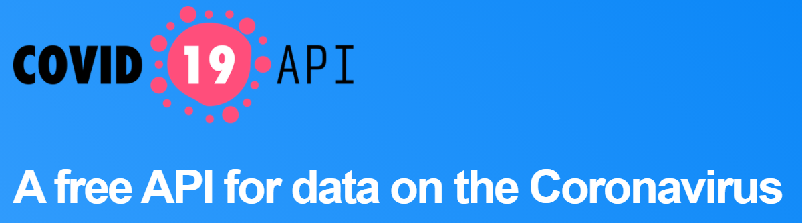

<a href="https://covid19api.com/">https://covid19api.com/</a> 
<h2 class="code-line" data-line-start=3 data-line-end=4 ><em>Es una api que ofrece datos sobre el coronavirus en el mundo</em></h2>

Esta api ofrece : 

<ul>
<li class="has-line-data" data-line-start="7" data-line-end="8">Datos actualizados varias veces al dia</li>
<li class="has-line-data" data-line-start="8" data-line-end="9">Acceso gratuito o pago </li>
</ul>
<h2 class="code-line" data-line-start=11 data-line-end=12 ><a id="Crear_11">Acceso gratuito o pago</a></h2>
<ul>
<li class="has-line-data" data-line-start="12" data-line-end="13">Pudes acceder a la informacion de manera gratuita o si necesitas mas datos tiene una seccion premium que tienes que pagar por mensualmente</li>
<h2 class="code-line" data-line-start=22 data-line-end=23 >Nuestra Consigna </h2>

El objetivo es entrega un cuadro con los tres países del mundo que mas contagios tiene en un determinado periodo de tiempo, con el nombre del país, la cantidad de contagiados en ese periodo y la cantidad de muertos.

<ul>
<h2 class="code-line" data-line-start=30 data-line-end=31 >Funcionamiento</h2>

Se debe tener instalado el entorno virtual, para crearlo

<pre><code>        py -m venv .\nombre\
</code></pre>

Accedemos a él con cd nombre, activamos los permisos de Windows para luego poder descargar lo que necesitemos en el entorno, con el comando

<pre><code>Set-ExecutionPolicy -ExecutionPolicy RemoteSigned -Scope Process.
</code></pre>

Luego para poder acceder y activar el entorno virtual entramos a la carpeta Scripts que está dentro del venv creado, para activarlo

<pre><code>                          .\activate
</code></pre>

Asi ya estoy dentro del entorno virtual creado 
Para instalar la libreria Matplotlib es mediante el comando

<pre><code>            pip install matplotlib
</code></pre>

Entonces ya ahi tengo la libreria instalada, tengo acceso a todos los paquetes que vienen dentro de ella, los puedo ver con el comando

<h2 class="code-line" data-line-start=51 data-line-end=52 >FUENTES</h2>

<strong>-Pag oficial</strong> 
<a href="https://matplotlib.org/">https://matplotlib.org/</a> 
<strong>-Marcadores y colores</strong> 
<a href="https://interactivechaos.com/es/manual/tutorial-de-matplotlib/marcadores-y-colores#:~:text=Uno%20de%20los%20siguientes%20nombres,representa%20%22blue%22%2C%20azul/">https://interactivechaos.com/es/manual/tutorial-de-matplotlib/marcadores-y-colores#:~:text=Uno de los siguientes nombres,representa &quot;blue&quot;%2C azul/</a> 
<strong>-Personalizar gráfica</strong> 
<a href="https://www.youtube.com/watch?v=0ZXv8gyjmws/">https://www.youtube.com/watch?v=0ZXv8gyjmws/</a> 
<a href="https://www.youtube.com/watch?v=XEG4eh5l_qU&amp;t=434s/">https://www.youtube.com/watch?v=XEG4eh5l_qU&amp;t=434s/</a>

<strong><em>Integrantes</em></strong> 
<strong>-Florencia Fernandez</strong> 
<strong>-Constanza Gigli</strong>

